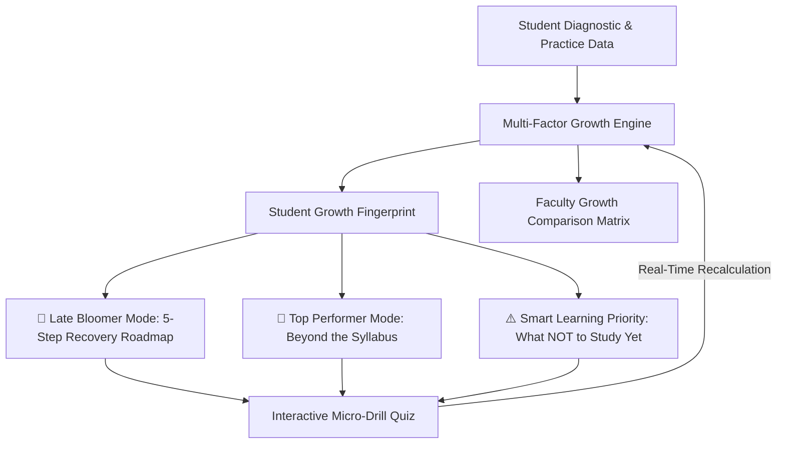

# 🌱 GrowthMind – AI Student Growth & Learning Mentor

> **“Not Just a Score. A Growth Journey.”**  
> *“Others personalize what you learn. GrowthMind personalizes how you grow.”*

---

## 🎯 Single Application URL

### **Single application URL: http://localhost:5000**

> [!IMPORTANT]
> The entire application (frontend UI, interactive charts, demo switcher, quiz engine, AI mentor, and backend APIs) is served from this **single URL**. You do not need to open or manage any second URL.

---

## ⚡ How to Start the Complete Project (One Command)

From the project root directory:

```bash
npm start
```

*(This automatically builds the frontend and starts the unified server on port 5000).*

Open your browser at:
**`http://localhost:5000`**

---

## 🚀 The Core Innovation & Vision

Existing learning platforms primarily provide course catalogs, static video lessons, and conventional leaderboard rankings that punish late bloomers with flat percentage averages.

**GrowthMind** flips the paradigm:
Instead of measuring static marks, **GrowthMind evaluates trajectory velocity, consistency, resilience, and error recovery patterns** to dynamically shape a personalized growth journey for every single student.



---

## 🏆 Key Features Accessible from the Single URL

1. **1-Click Hackathon Demo Switcher (`DemoSwitcher.jsx`)**:
   - Pinned at the top of the interface:
     - 🌱 **Tharun (Late Bloomer)**: 75% score, **$+28\%$ growth momentum**, High Growth Potential
     - 👑 **Aadhya (Top Performer)**: 92% score, $+4\%$ momentum, Beyond Syllabus Mode
     - 📚 **Rohan (Developing Learner)**: 61% score, $+12\%$ momentum, Foundation Track
     - 🔥 **Priya (Consistent Learner)**: 78% score, $+10\%$ momentum, 16-Day Streak
     - 🎓 **Prof. Sharma (Faculty)**: Cohort Overview & Growth Comparison Matrix
   - **`⚡ Test Live Quiz`** quick launcher button to test real-time path recalculation.

2. **Student Growth Fingerprint (`GrowthFingerprint.jsx`)**:
   - Multi-factor non-punitive radar evaluation (Performance, Improvement Rate, Consistency, Mistake Control, Topic Mastery, Challenge Handling).
   - Trajectory Area Chart ($40\% \to 48\% \to 57\% \to 68\% \to 75\%$).

3. **Late Bloomer Mode: Growth Recovery Plan (`LateBloomerRecovery.jsx`)**:
   - Priority indicators: 🔴 High Priority (**Functions 48%**, **Arrays 52%**), 🟡 Medium Priority (**Strings 64%**), 🟢 Strong (**Variables 88%**).
   - 5-step sequential roadmap.

4. **Top Performer Mode: “Beyond the Syllabus” (`TopPerformerBeyond.jsx`)**:
   - 8 Innovation Tracks: Advanced Graph Algorithms, Route Optimization Microservice, Hackathons, AWS Certifications, Research Papers, Competitive Programming, Campus AI Extension, Peer Mentoring.

5. **“What Should I NOT Study Now?” – Smart Learning Priority (`WhatNotToStudy.jsx`)**:
   - Prerequisite conflict engine. Blocks premature topics (e.g. Advanced AI blocked until Functions/Arrays pass) and reveals the sequential prerequisite roadmap.

6. **Interactive Quiz Engine & Dynamic Path Recalculator (`InteractiveQuizModal.jsx` & `DynamicLearningPath.jsx`)**:
   - 3-question live drill with instant grading, celebration confetti, and automatic priority shifts from Functions to Arrays!

7. **Mistake Analyzer & Score Change Explainer (`MistakeAnalyzer.jsx` & `ScoreChangeExplainer.jsx`)**:
   - Dissects repeated mistake clusters with code diffs and explains score swings with transparent factor attributions.

8. **Faculty Dashboard & Growth Comparison (`FacultyDashboard.jsx`)**:
   - Replaces toxic leaderboards with the **Growth Comparison Matrix**, valuing improvement velocity over static marks.

9. **AI Mentor Workspace (`AIMentorDrawer.jsx` & `MentorPage.jsx`)**:
   - Contextual mentor tailored to each student persona with actionable prompt chips.

---

## 🎬 30-Second Hackathon Demo Flow

1. Open **`http://localhost:5000`** $\to$ Inspect Landing Page hero (*“Not Just a Score. A Growth Journey.”*).
2. Click **“Try Interactive Demo”** $\to$ Log in as **Tharun (Late Bloomer)**.
3. Show **Growth Fingerprint**: Highlight $+28\%$ momentum without negative labeling.
4. Show **Smart Priority**: Click *"What Should I NOT Study Now?"* to show prerequisite gating on Advanced AI.
5. Click **“⚡ Test Live Quiz”** at the top bar $\to$ Answer 3 questions on Functions $\to$ Submit to watch Functions mastery jump from $48\% \to 64\%$ in real time!
6. Click **Aadhya (Top Performer)** in the 1-click switcher $\to$ Show *“Beyond the Syllabus”* research and route optimization project.
7. Click **Prof. Sharma (Faculty)** in the 1-click switcher $\to$ Show the *Growth Comparison Matrix* highlighting Tharun's $+28\%$ momentum over static scores.
8. End with: *“Others personalize what you learn. GrowthMind personalizes how you grow.”*

---

© 2026 GrowthMind AI Mentor.
